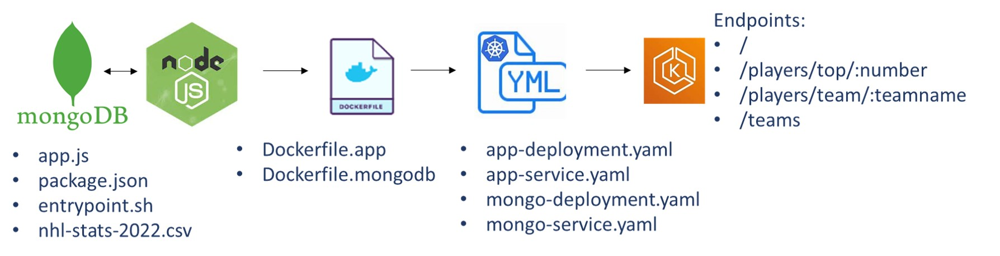
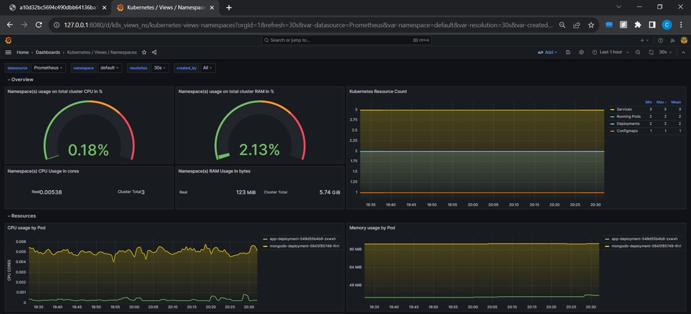
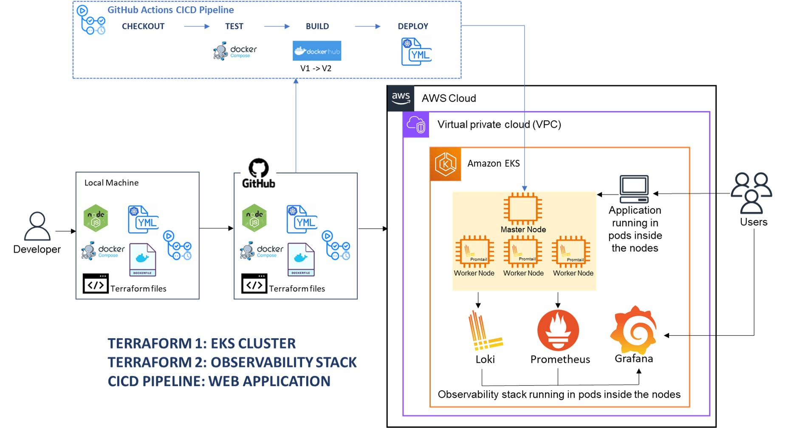
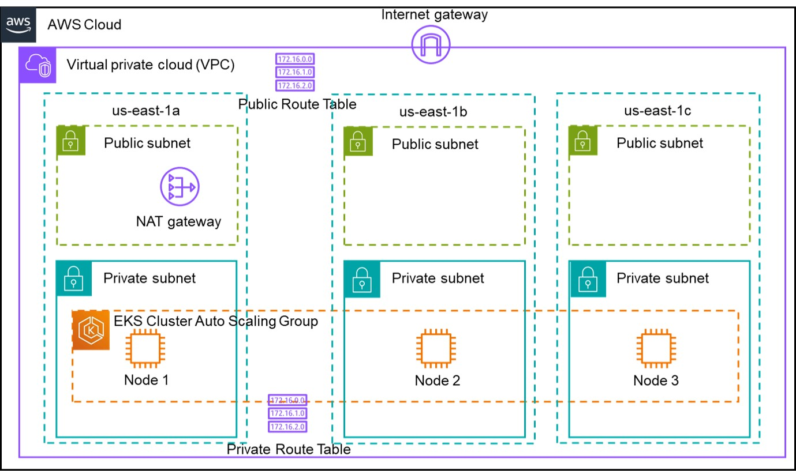

# Final Capstone DevOps Project - End-to-end DevOps Pipeline

This project builds an end-to-end DevOps pipeline using core technologies such as AWS, Docker, Kubernetes, Terraform, Prometheus, Loki, Grafana, and GitHub Actions. This pipeline is used to deploy a multi-container web application that comprises a MongoDB database and a Nodejs API server, which exposes endpoints so users can send HTTP requests and get a response. 

The project consists of three main sections:
- Section 1: Terraform code to deploy a functional and multi-node AWS EKS Cluster.
- Section 2: Terraform code to deploy a complete observability stack (Prometheus, Loki, Grafana) into the EKS Cluster using Helm Charts.
- Section 3: GitHub Actions CICD Pipeline responsible for code checkout, test, build, and deploy stages of the web application in the EKS Cluster. The pipeline can be triggered manually or by pushes on the GitHub repo. The test step tests the integration of the Dockerfiles using a Docker-compose file, while the build step is responsible for building the Docker Images and pushing them to Docker Hub. At last, the deployment stage will connect to the EKS Cluster and deploy the web application using the recently created Docker Images.



This README file will briefly describe the steps to launch the EKS cluster, the observability system, and the web application.

URL for the public GitHub repository: https://github.com/caroldelwing/WCD-DevOps-FinalCapstone

## Table of contents

- [Prerequisites](#prerequisites)
- [Installation](#installation)
- [Getting Started](#getting-started)
- [Usage](#usage)
- [Testing the Results](#testing-the-results)
- [Authors](#authors)

## Prerequisites

- AWS account;
- DockerHub account;
- IAM user with sufficient rights;
- Access to a Linux terminal;
- Have AWS CLI, git, Terraform CLI, and kubectl installed on your Linux machine;
- Knowledge of Docker, Kubernetes, Terraform, AWS EKS, and Git. 

## Installation

To install the required tools, follow the steps in the links below:

- AWS CLI:
https://docs.aws.amazon.com/cli/latest/userguide/getting-started-install.html

- Git:
https://git-scm.com/book/en/v2/Getting-Started-Installing-Git

- Terraform:
https://developer.hashicorp.com/terraform/tutorials/aws-get-started/install-cli

- Kubectl:
https://kubernetes.io/docs/tasks/tools/

## Getting Started

- To have access to your AWS account through your IAM user, execute the following command in your terminal
```sh
$ aws configure
AWS Access Key ID [None]: paste your access key id
AWS Secret Access Key [None]: paste your secret access key
Default region name [None]: us-east-1
Default output format [None]: just press enter
```

Fork this Repository:
Click the "Fork" button at the top-right corner of the repository page. This will create a copy of the repository under your GitHub account.

- In your terminal, clone the forked repository and navigate to the WCD-DevOps-FinalCapstone folder (replace the link below with the link to your repo):
```sh
git clone https://github.com/caroldelwing/WCD-DevOps-FinalCapstone.git
cd WCD-DevOps-FinalCapstone
```

- In your new GitHub repo, create secrets for your Dockerhub and AWS credentials by following the steps in the link below:
https://docs.github.com/pt/actions/security-guides/encrypted-secrets

Make sure to name your secrets exactly as below, and fill them with the values of your credentials (AWS access key and DockerHub token, which need to be created if you don't have one already):
- `DOCKERHUB_TOKEN`
- `DOCKERHUB_USERNAME`
- `AWS_ACCESS_KEY_ID`
- `AWS_SECRET_ACCESS_KEY`

## Usage

- Part 1: deploy the EKS Cluster with Terraform:
    Navigate to the eks-cluster folder and execute the following Terraform comands:
```sh
cd WCD-DevOps-FinalCapstone/eks-cluster
terraform init
terraform validate
terraform plan
terraform apply -auto-approve
```
Once your EKS cluster is up and running (this may take up to 15 minutes), configure kubectl to interact with your cluster by running this command in your terminal:
```sh
aws eks update-kubeconfig --region us-east-1 --name eks-wcd-final
```

- Part 2: deploy a complete observability stack in the EKS Cluster with Terraform:
    Navigate to the observability folder and execute the following Terraform commands:
```sh
cd ../observability
terraform init
terraform validate
terraform plan
terraform apply -auto-approve
```
Access Grafana using port-forwarding. Execute the command below and then type http://127.0.0.1:8080/ on your web browser. User is admin and password is prom-operator.
```sh
kubectl port-forward service/kube-prometheus-stack-grafana 8080:80 -n monitoring
```
The Kube-Prometheus-Stack has many dashboards ready to monitor your cluster; you can access them in the section "Dashboards" of Grafana. I also suggest you import the following dashboards: 15757, 15758, 15759, and 15760 for better visualization of your cluster metrics. 
Lastly, add Loki as Data Source in Grafana, using the URL http://loki:3100. Then, import the dashboard ID 12611 for logs visualization.

- Part 3:
  Change to folder .github/workflows:
```sh
cd WCD-DevOps-FinalCapstone/.github/workflows
```
Open the cicd-pipeline.yaml file with a text editor and change the name of the docker images (lines 54 and 55) according to your Dockerhub username and desired image names. Moreover, you have to edit the docker image names in the Kubernetes YAML manifests (app-deployment.yaml and mongo-deployment.yaml). Then, commit and push the changes to your GitHub repository, which will trigger the pipeline that will checkout the code, test, build the images, and deploy the application in your running EKS cluster.

```sh
#add changes you made
git add .
#commit changes you made
git commit -m "Updated image names in the pipeline and k8s manifests"
#push committed changes 
git push origin main
```

## Testing the Results

Execute the following command in your terminal to access the web application on your browser. You'll get the external IP of the load balancer of the application service:
```sh
kubectl get services
```
Copy and paste the load balancer external IP (which is the load balancer address) in your browser and add the desired route. 

Available routes:
- `/` - returns all documents in the nhl_stats_2022 collection.
- `/players/top/:number` - returns top players. For example, /players/top/10 will return the top 10 players leading in points scored.
- `/players/team/:teamname` - returns all players of a team. For example, /players/team/TOR will return all players of Toronto Maple Leafs.
- `/teams` - returns a list of the teams.

For the observability stack, access Grafana again using port-forwarding:
```sh
kubectl port-forward service/kube-prometheus-stack-grafana 8080:80 -n monitoring
```
- Open the dashboards you imported previously and have fun! Below, you can find an example showing the pods of the recently deployed web application:


- Don't forget to delete everything once you're finished to avoid unnecessary costs.

## Diagram
Below, you can check diagrams of the CICD pipeline integrated with the cloud architecture, as well as a more detailed diagram of the cloud components.





## Authors

- Beatriz Carvalho de Oliveira - https://github.com/beatrizCarvalhoOliveira
- Carolina Delwing Rosa - https://github.com/caroldelwing
- Zakiir Juman - https://github.com/zakiirjuman
